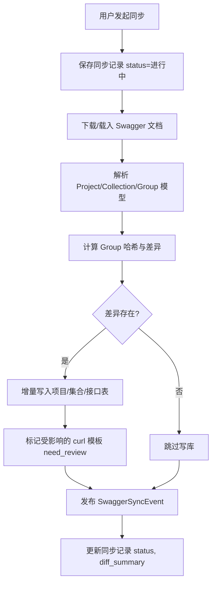
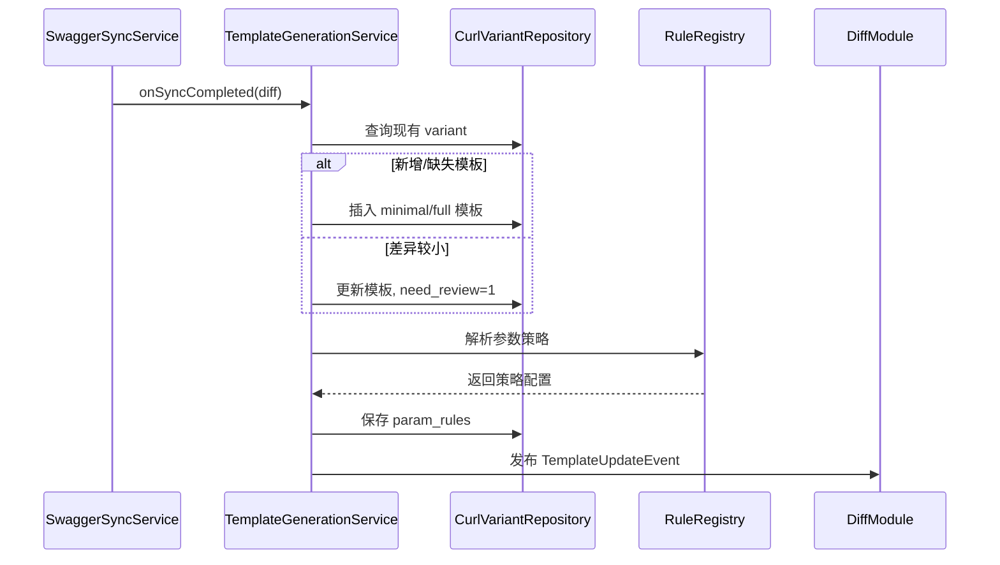
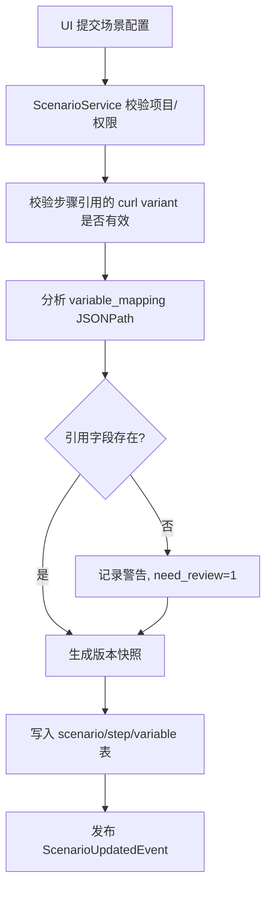
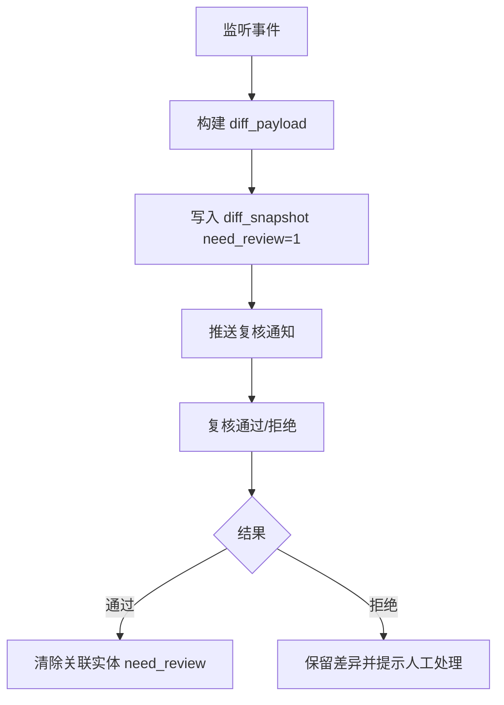

# 自动生成 Swagger 接口测试场景系统详细设计

## 1. 基础设施初始化（阶段 0）
### 1.1 目标
- 搭建基于 `auto-test-parent` 的 Maven 多模块工程骨架，与 `ruoyi-vue-pro` 基础设施兼容。
- 提供统一的配置、持久化、审计与权限能力，支撑后续模块开发与运行。

### 1.2 模块结构
- `auto-test-parent`: 统一依赖版本、打包管理。
- `auto-test-infra`:
  - 继承 RuoYi 的 `yudao-framework` 配置。
  - 封装 `MyBatis-Plus`, `RedisTemplate`, `RestTemplate`, `ThreadPoolTaskExecutor` 等基础 Bean。
  - 提供 `BaseDO`, `BaseMapperX`, 通用 `PageResult`、`ErrorCode` 枚举。

### 1.3 核心组件
| 组件 | 职责 |
| --- | --- |
| `DataSourceConfig` | 配置主库连接、Hikari 池参数、读写分离预留。 |
| `MybatisConfiguration` | 扫描 Mapper、注入分页插件、乐观锁插件。 |
| `RedisConfig` | 连接 Redis，提供 JSON 序列化模板。 |
| `ThreadPoolConfig` | 定义执行器线程池（core=4, max=8, queue=100）。 |
| `BizIdGenerator` | 抽象雪花算法，提供跨模块一致的 ID 生成服务。 |

### 1.4 配置管理
- `application.yaml` 维护最小配置，敏感信息放置于外部文件。
- 通过 `SysConfig` 字典配置执行器并发、Webhook 开关、通知通道。
- 预置的配置键需在 Flyway Init 脚本中插入，便于 UI 调整。

### 1.5 安全与权限
- 复用 RuoYi 登录、权限体系，新增菜单：`Swagger 项目`、`模板库`、`场景编排`、`执行记录`、`差异复核`。
- 每个业务模块的 REST 接口均继承 `BaseController`, 统一返回结构与鉴权。

### 1.6 日志与监控
- 统一引入 `slf4j`，业务日志落 DB 由各模块负责。
- `infra` 模块提供 `OperationLogAspect`、`AuditLogService` 以记录敏感操作。

## 2. Swagger 同步子系统（阶段 1）
### 2.1 目标
- 支持从 URL/文件导入 Swagger 文档，解析生成项目、集合、接口三层结构。
- 记录同步历史、差异概要，为模板生成提供基础数据。

### 2.2 服务划分
| 服务 | 说明 |
| --- | --- |
| `SwaggerSourceService` (`swagger-biz`) | 管理项目、环境配置、同步入口。 |
| `SwaggerParser` | 基于 `swagger-parser`/`jackson` 解析 OpenAPI，生成内部模型。 |
| `GroupDiffCalculator` | 比较旧记录与新文档，输出新增/修改/删除清单。 |
| `SwaggerSyncService` | 编排同步流程，发布 `SwaggerSyncEvent`。 |

### 2.3 数据模型
- `autotest_project`: 记录 Swagger 源、同步状态、版本信息。
- `autotest_collection`: Tag 层级；`order_no` 用于 UI 排序。
- `autotest_group`: 接口定义，包含 `hash`、`request_schema`、`response_schema`。
- `autotest_swagger_sync`: 每次同步详情与差异摘要。

### 2.4 同步流程

- 下载失败或解析异常时，更新 `status=失败`，记录 `error_message`。
- 同步时写入 `last_sync_id` 到接口表，以供模板模块判断最新数据。

### 2.5 关键接口
| 接口 | 方法 | 描述 |
| --- | --- | --- |
| `/api/swagger/projects` | GET/POST/PUT | 项目 CRUD、同步触发。 |
| `/api/swagger/projects/{id}/sync` | POST | 触发指定项目同步。 |
| `/api/swagger/projects/{id}/diff` | GET | 查询最近一次同步的差异摘要。 |

### 2.6 异常处理
- 解析时统计异常字段，写入 `diff_summary.invalidNodes`，前端提示需要手工补充。
- 对超大文档采用分页处理（按 Tag 分批写库），避免单事务过大。

## 3. 模板与随机策略子系统（阶段 2）
### 3.1 目标
- 根据最新接口元数据生成最小/全量 `curl` 模板。
- 支持随机策略库与手动校正，记录审计历史。

### 3.2 服务组件
| 组件 | 职责 |
| --- | --- |
| `TemplateGenerationService` | 基于 `autotest_group` 构造请求示例，生成 `curl_template`。 |
| `RuleRegistry` | 注册内置随机策略（枚举、正则、手机号等）。 |
| `RuleOverrideService` | 处理用户手动编辑规则，写入审计表。 |
| `TemplatePreviewFacade` | 提供模板预览、实时随机样例接口。 |

### 3.3 数据模型
- `autotest_curl_variant`: 保存模板内容、随机规则、编辑信息。
- `autotest_rule_audit`: 保存变更快照，便于追溯。

### 3.4 模板生成流程

- 模板类型支持扩展：`minimal`、`full`、`custom`。自定义模板需保留 `rule_version` 便于回滚。

### 3.5 接口契约
| 接口 | 方法 | 说明 |
| --- | --- | --- |
| `/api/template/variants` | GET | 按接口查询模板列表。 |
| `/api/template/variants/{id}` | PUT | 手工编辑模板或随机规则。 |
| `/api/template/variants/{id}/preview` | POST | 生成随机样例，入参为动态变量上下文。 |
| `/api/template/rules/audit` | GET | 查询审计记录。 |

### 3.6 策略扩展
- 策略库以 `StrategyType` + `RuleHandler` 注册，支持 YAML/JSON 配置。
- 失败兜底：若缺少策略，生成器回退到类型默认值（string="demo", number=1）。

## 4. 场景建模与编排（阶段 3）
### 4.1 目标
- 提供场景生命周期管理、步骤编排、变量映射能力。
- 支持多环境、重试策略及场景版本化。

### 4.2 服务组件
| 服务 | 职责 |
| --- | --- |
| `ScenarioService` | 场景 CRUD、状态切换、版本发布。 |
| `ScenarioStepService` | 步骤管理、顺序调整、变量依赖检测。 |
| `ScenarioVariableService` | 维护场景/步骤变量池、默认值、来源。 |
| `ScenarioVersionService` | 保存 JSON 快照，用于回滚/审计。 |

### 4.3 数据模型
- `autotest_scenario`: 场景基本信息、默认环境、是否需复核。
- `autotest_scenario_step`: 步骤顺序、变量映射、提取器配置。
- `autotest_scenario_variable`: 变量定义与绑定。
- `autotest_scenario_version`: 场景快照。

### 4.4 场景保存流程

- 保存后默认状态为草稿，需发布才可执行。
- 版本发布时更新 `autotest_scenario.need_review=0`，并写入 `scenario_version`。

### 4.5 场景接口
| 接口 | 方法 | 描述 |
| --- | --- | --- |
| `/api/scenario/list` | GET | 支持按项目、标签过滤。 |
| `/api/scenario/{id}` | GET | 获取场景详情。 |
| `/api/scenario` | POST | 新建场景（保存草稿）。 |
| `/api/scenario/{id}` | PUT | 更新场景。 |
| `/api/scenario/{id}/publish` | POST | 发布场景，生成版本记录。 |
| `/api/scenario/{id}/variables` | GET | 查询变量池。 |

### 4.6 校验与提示
- 变量映射校验：后台解析 JSONPath，无法解析时标记 warning，但允许保存。
- 如果引用的 `curl_variant` 处于 `need_review=1`，保存时将场景 `need_review` 置为 1。
- 默认环境缺失时，执行器需用户手动选择环境。

## 5. 场景执行器（阶段 4）
### 5.1 目标
- 编排场景执行，串行步骤调用，记录日志与变量轨迹。
- 支持重试策略、执行互斥、通知。

### 5.2 核心组件
| 组件 | 职责 |
| --- | --- |
| `ExecutionFacade` | 提供 REST 触发、队列管理、权限校验。 |
| `ExecutionDispatcher` | 校验项目/租户并发配额，调度线程池。 |
| `StepRunner` | 构建请求 -> 调用 -> 解析响应 -> 保存变量。 |
| `ExecutionLogService` | 写入项目分表日志 & 推送通知。 |
| `VariableContext` | 维护步骤间变量，支持 JSONPath 读取/写入。 |

### 5.3 数据模型
- `autotest_execution`: 执行实例主表。
- `autotest_execution_detail`: 步骤执行结果与快照。
- `autotest_execution_log_{projectId}`: 细粒度运行日志。

### 5.4 执行流程
```mermaid
sequenceDiagram
  participant User as 用户/触发方
  participant API as ExecutionFacade
  participant Dispatcher as ExecutionDispatcher
  participant Runner as StepRunner
  participant DB as 数据库
  User->>API: POST /api/execution/trigger
  API->>Dispatcher: 校验权限/互斥
  Dispatcher->>DB: 创建 execution(status=排队)
  Dispatcher->>Runner: 提交线程任务
  Runner->>DB: 加载场景/步骤/变量
  loop steps 顺序
    Runner->>Runner: 构建请求上下文
    Runner->>RemoteAPI: 发起 curl/HTTP 请求
    alt 成功
      Runner->>DB: 写 detail(status=成功)
      Runner->>VariableContext: 提取变量
    else 失败
      Runner->>Runner: 根据 retry_policy 重试
      Runner->>DB: 更新 detail(status=失败)
      Runner->>ExecutionLog: 写日志
      break
    end
  end
  Runner->>DB: 更新 execution 状态 & 统计
  Runner->>Notification: 发送通知
```

### 5.5 REST 接口
| 接口 | 方法 | 描述 |
| --- | --- | --- |
| `/api/execution/trigger` | POST | 入参：`scenarioId`, `envId`, `remark`。返回 executionId。 |
| `/api/execution/{id}` | GET | 查看执行详情（含步骤、日志聚合）。 |
| `/api/execution/{id}/logs` | GET | 分页查询日志。 |
| `/api/execution/{id}/cancel` | POST | 若状态为排队/执行中，尝试取消。 |

### 5.6 互斥与配额
- 通过 `ScenarioLockRegistry`（基于 `ConcurrentHashMap`）保证同一场景串行执行。
- 配额策略：`projectQuota` 与 `tenantQuota` 可动态调整，超限时返回友好提示。

### 5.7 错误处理
- HTTP 调用失败时记录请求/响应快照，error message 缩短至 1000 chars。
- 如果日志表写入失败（分表不存在），执行器捕获异常并尝试自动建表；超过 3 次失败触发告警。

## 6. 差异管理与复核（阶段 5）
### 6.1 目标
- 跟踪 Swagger 重生成、模板变更、场景同步产生的差异。
- 提供复核流程，降低自动更新风险。

### 6.2 服务组件
| 服务 | 职责 |
| --- | --- |
| `DiffCaptureService` | 监听同步/模板事件，生成差异快照。 |
| `DiffReviewService` | 处理复核、通过、拒绝操作。 |
| `DiffNotificationService` | 推送待办至站内信/邮件。 |

### 6.3 数据模型
- `autotest_diff_snapshot`: 差异实体，记录来源、快照、状态。
- `need_review` 字段与场景、模板联动，复核通过后清零。

### 6.4 流程


### 6.5 接口
| 接口 | 方法 | 描述 |
| --- | --- | --- |
| `/api/diff/list` | GET | 按项目、状态筛选差异。 |
| `/api/diff/{id}` | GET | 查看差异详情。 |
| `/api/diff/{id}/review` | POST | 复核操作，入参：`status`, `comment`。 |

## 7. 横切关注点（阶段 6）
### 7.1 审计与操作记录
- 重要操作（模板编辑、场景发布、复核）调用 `AuditLogService.record(operation, before, after)`。
- 审计日志表使用 RuoYi 原生 `sys_operate_log`，无需重复造表。

### 7.2 消息通知
- 事件发布后默认由 `NotificationGateway` 写入站内信，可按需扩展钉钉/企微。
- 配置在 `SysConfig` 中启用/禁用通知通道。

### 7.3 性能与扩展
- 解析与模板生成聚焦读操作，尽量批量插入/更新。
- 执行器日志落地策略可在未来接入 ELK；当前阶段采用 DB 分表 + 文件日志双写。

### 7.4 测试策略
- 单元测试：覆盖解析器、模板生成器、JSONPath 解析、变量上下文。
- 集成测试：`SwaggerSyncServiceIT`、`ScenarioExecutionIT` 使用 H2 + MockServer。
- 性能测试：针对执行器线程池模拟 50 个场景队列，监控平均时延。

### 7.5 运维
- 运维脚本：
  - `scripts/create_log_table.sh {projectId}`：复制日志模板表。
  - `scripts/seed_config.sh`：插入默认配置。
- 监控指标：同步耗时、场景执行成功率、日志写入失败次数。

## 8. 里程碑与风险
### 8.1 开发顺序与里程碑
1. 基础设施与数据库初始化（阶段 0）。
2. Swagger 同步能力与项目管理（阶段 1）。
3. 模板生成与规则库（阶段 2）。
4. 场景编排与版本管理（阶段 3）。
5. 执行器与日志链路（阶段 4）。
6. 差异管理与复核（阶段 5）。
7. 横切能力补充与上线前测试（阶段 6）。

### 8.2 主要风险
- **Swagger 非规范**：需要手工纠偏入口与校验日志。
- **随机策略覆盖不足**：需定期补充策略库，支持灰度验证。
- **执行器资源不足**：需监控线程池指标，预留限流措施。
- **差异复核滞后**：建议接入提醒机制，并在 UI 上突出需复核场景。

---

本文档依据当前 PRD 与架构设计输出，后续如规格调整，请同步更新对应章节。
